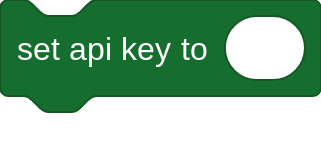

<!---- Are you trying to see something or what? Here's this cat---->
<!----
                            ╱|、
                          (˚ˎ 。7  
                           |、˜〵          
                          じしˍ,)ノ
---->

# Sports Extension
A Scratch Extension for getting anything sports related like the NFL!
Over the past weeks, I have been experimenting with Scratch Extensions and I thought it was cool to make my own. I've started by making YouTube Statistics however someone had done that. This is when I started thinking about ideas and that's when we got a Sports Extension.

# Documentation
These are the basic usage of the Sports Extension. Anyone who reads this will get the basic understanding of how it works.<br>
A Scratch Project documentation will be released soon!<br>

> [!note]
> To use this, use the [TurboWarp URL](https://turbowarp.org/editor?extension=https://radicalofficial.github.io/sports.js)

> [!important]
> **In order to get an API Key, please sign up at [RapidAPI](https://rapidapi.com) or else the extension will not work!**

<br><br>
## Getting Started
To get started, copy your API Key from RapidAPI and enter it in this block below.<br><br>
<br>
The block above will not return anything when clicked, the only way to test to see if your API Key works is to use any block made by this extension. Errors appearing due to no API Key are intentional.

**More Usages:**<br>
Here are all the blocks that is compatible with the API Key.
```
/* FOOTBALL / NFL */

(player (Your NFL Player) stats)   // Gets the stats for the player, If the Status Code is 200, that means it's successful.

(player's [short name/jersey/team/height/age/birthday/position v])

/* Details about the block */
// Short name - Gets a shorter version of the name. E.g. Tom Brady -> T. Brady
// Jersey - Player's jersey number
// Team - Player's team they're in
// Height - Player's height
// Age - Player's Age
// Birthday - You get what this is but in case you don't, Player's B-Day
// Position - Player's Position. E.g. QB -> QuarterBack


(get NFL teams)    // Gets the NFL Teams
(team index (Number Here) stats)     // Gets the index team's stats e.g. 1 being GreenBay Packers
(team's [ratio/abbreviation/streak v]) // Gets the Team's Win-Loss Ratio (5-2), Team Abbreviation (Atlanta -> ATL) or Win/Loss Streak.
(random team stats from (value)) // Replace value with a number, gets a random team within the value range e.g. 6 will be pick random 1-6
(days until Super Bowl)    // The Days until the Super Bowl LVIII (The next super bowl will not be accurate like Super Bowl LVIV, no API key needed) 
```
<br>

> [!warning]
> Using the player stats block incorrectly will cause bugs. Please use actual players, not random letters.

For any bug reports, please send a github issue or pull request. Thank you!

# Socials/Credits
Thank you for using, this is the end of the documentation.

Credits to [@wolfieboy09](https://github.com/wolfieboy09) for collaborating to make this project.<br>
Credits to [RapidAPI](https://rapidapi.com) for making this possible.<br>
... and everyone who contributed and assisted.<br>

[](https://repl.it/@Knightbot63/)
[](https://scratch.mit.edu/users/Knightbot63/)
[](https://youtube.com/@Mrbeast)
